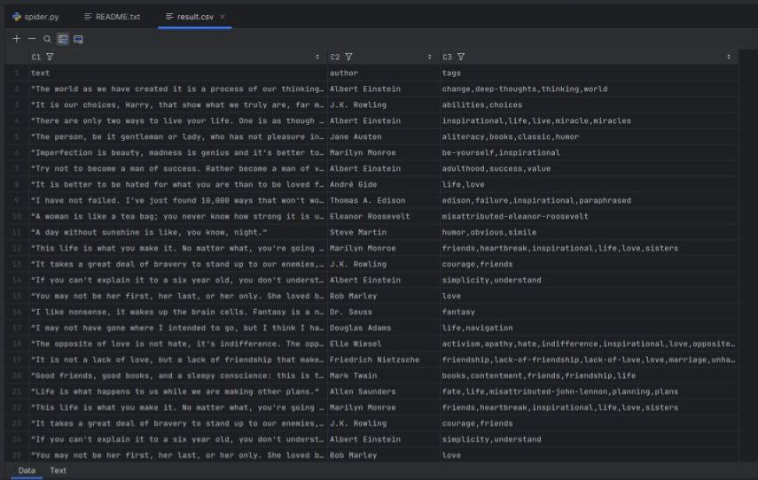

***This project i made for my portfolio but if you want you can run this***
# About
This script parse site with quotes  
For this goal i used Scrapy

### How to run?:

1. You need download requirements:
    `pip install -r requirements.txt`
2. Now you can run this:
   `python spider.py`

## EXAMPLE

